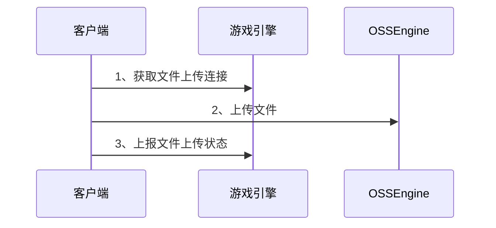
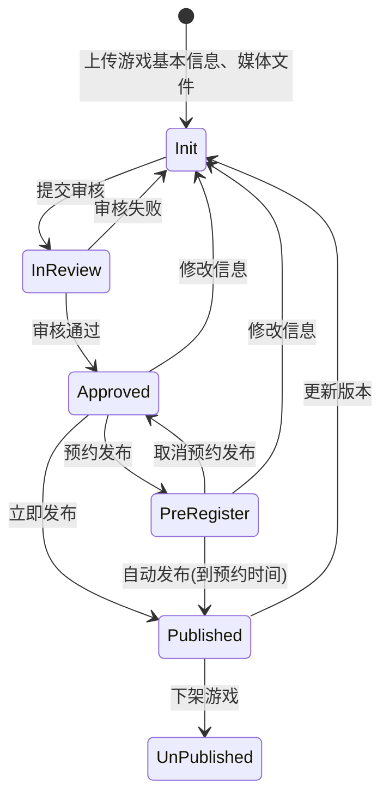

# 游戏分发平台

## 游戏媒体信息
- 游戏图标(ICON)
    - MediaType: 1
    - 只允许上传一个
- 游戏宣传图片(Images)
    - MediaType: 2
    - 允许上传多个
- 游戏宣传视频
    - MediaType: 3
    - 只允许上传一个，限制50MB
- 游戏本体
    - MediaType: 4
    - APK：独立安装包，限制500MB
    - H5: 设置游戏链接

## 游戏状态流转
- **Init(初始状态)**：
    - 游戏开发者上传游戏基本信息、媒体文件。
    - 客户端不可见。
- **InReview(审核中)**: 
    - 游戏基本信息、媒体文件上传完成后，才可提交审核。 
    - 客户端不可见。
- **Approved(审核通过)**: 
    - 合法合规检查, 审核通过后，可选择 立即发布/预约发布。
    - 客户端不可见。
- **PreRegister(可预约)**: 
    - 只有选择预约发布的游戏，才能进入此状态。
    - 客户端部分场景可见(即将上新接口)。
- **Published(已上架)**:
    - 客户端的接口，应该只能看到 已上架/已下架 的游戏。
    - 客户端可见。
- **UnPublished**: 已下架
    - 客户端部分场景可见(历史游戏接口)。

# TODO List
- 游戏审核历史记录，是否需要记录其它历史？要基于数据库、业务逻辑一起考虑