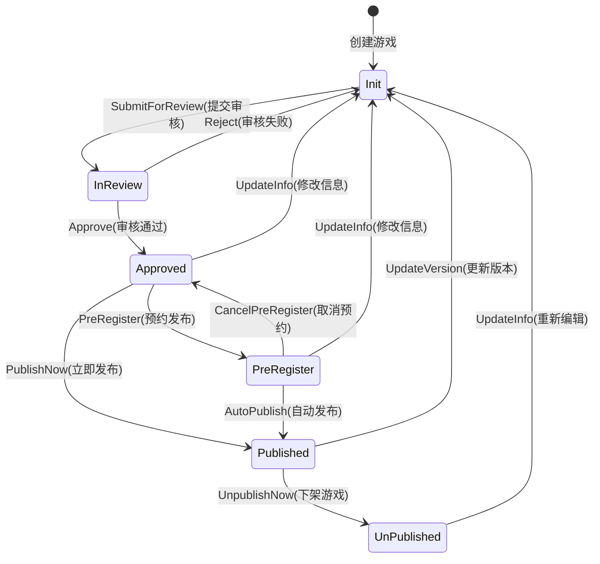

# 游戏状态事件驱动系统说明

## 概述
本次改进实现了完整的事件驱动状态机系统，使游戏状态流转更加清晰、可维护和可扩展。

## 核心改进

### 1. 完整的事件定义 (`internal/model/game.go`)

新增了完整的游戏事件类型：
```go
const (
    SubmitForReview   GameEvent = iota // 提交审核
    Approve                            // 审核通过
    Reject                             // 审核失败
    PreRegister                        // 预约发布
    PublishNow                         // 立即发布
    UpdateInfo                         // 更新游戏信息
    CancelPreRegister                  // 取消预约发布
    UnpublishNow                       // 立即下架
    UpdateVersion                      // 更新游戏版本
    AutoPublish                        // 自动发布(预约时间到达)
)
```

新增了事件名称获取函数：
```go
func GetGameEventText(event GameEvent) string
```

### 2. 状态转移映射表 (`internal/logics/game/game_status.go`)

实现了完整的状态机定义：

```go
var stateTransitionMap = map[model.GameStatus]map[model.GameEvent]*Transition{
    // Init(初始状态)
    model.GameStatusInit: {
        model.SubmitForReview: {TargetStatus: model.GameStatusInReview},
    },
    // InReview(审核中)
    model.GameStatusInReview: {
        model.Approve: {TargetStatus: model.GameStatusApproved},
        model.Reject:  {TargetStatus: model.GameStatusInit},
    },
    // Approved(审核通过)
    model.GameStatusApproved: {
        model.PreRegister: {TargetStatus: model.GameStatusPreRegister},
        model.PublishNow:  {TargetStatus: model.GameStatusPublished},
        model.UpdateInfo:  {TargetStatus: model.GameStatusInit},
    },
    // PreRegister(可预约)
    model.GameStatusPreRegister: {
        model.AutoPublish:         {TargetStatus: model.GameStatusPublished},
        model.CancelPreRegister:   {TargetStatus: model.GameStatusApproved},
        model.UpdateInfo:          {TargetStatus: model.GameStatusInit},
    },
    // Published(已上架)
    model.GameStatusPublished: {
        model.UnpublishNow:    {TargetStatus: model.GameStatusUnpublished},
        model.UpdateVersion:   {TargetStatus: model.GameStatusInit},
    },
    // Unpublished(已下架)
    model.GameStatusUnpublished: {
        model.UpdateInfo: {TargetStatus: model.GameStatusInit},
    },
}
```

### 3. 统一的事件处理入口

新增核心方法：

#### `HandleGameEvent` - 事件驱动的状态转换统一入口
```go
func (gg *Game) HandleGameEvent(ctx context.Context, gameID int64, event model.GameEvent) error
```

自动验证：
- 游戏是否存在
- 当前状态是否支持该事件
- 状态转换是否合法

自动执行：
- 状态转换前的业务逻辑
- 数据库更新
- 状态转换后的业务逻辑
- 日志记录

#### `GetAvailableEvents` - 获取当前状态可用的事件列表
```go
func (gg *Game) GetAvailableEvents(ctx context.Context, gameID int64) ([]model.GameEvent, error)
```

返回当前游戏状态下所有可执行的事件，用于前端动态显示可用操作。

### 4. 新增的状态转换方法

```go
// 取消预约发布（PreRegister -> Approved）
func (gg *Game) CancelPreRegisterGame(ctx context.Context, gameID int64) error

// 更新游戏信息（当前状态 -> Init）
func (gg *Game) UpdateGameInfo(ctx context.Context, gameID int64) error

// 更新游戏版本（Published -> Init）
func (gg *Game) UpdateGameVersion(ctx context.Context, gameID int64) error
```

### 5. 重构现有方法

所有状态转换方法现在统一使用事件驱动方式：

```go
// 提交审核
func (gg *Game) SubmitForReview(ctx context.Context, id int64) error {
    return gg.HandleGameEvent(ctx, id, model.SubmitForReview)
}

// 审核通过
func (gg *Game) Approve(ctx context.Context, id int64) error {
    return gg.HandleGameEvent(ctx, id, model.Approve)
}

// 其他方法类似...
```

### 6. 自动发布功能完善

完善了定时任务自动发布功能：

```go
func (gg *Game) handleScheduledPublish(ctx context.Context) error {
    // 查找所有到期的预约游戏
    var games []*entity.Game
    err := dao.Game.Ctx(ctx).
        Where(dao.Game.Columns().Status, int(model.GameStatusPreRegister)).
        Where("publish_time <= ?", time.Now()).
        Scan(&games)
    
    // 自动发布
    for _, game := range games {
        err = gg.HandleGameEvent(ctx, game.ID, model.AutoPublish)
        // 错误处理...
    }
}
```

### 7. 新增API接口

#### 取消预约发布
```
POST /games/{id}/cancel-pre-register
```

#### 更新游戏信息
```
POST /games/{id}/update-info
```

#### 更新游戏版本
```
POST /games/{id}/update-version
```

#### 获取可用事件列表
```
GET /games/{id}/available-events
```

返回示例：
```json
{
    "events": [
        {
            "event": 0,
            "event_name": "提交审核",
            "next_status": 1,
            "next_status_name": "审核中"
        }
    ]
}
```

## 完整的状态流转图



## 使用示例

### 1. 提交审核
```go
err := service.Game().SubmitForReview(ctx, gameID)
```

### 2. 获取可用操作
```go
events, err := service.Game().GetAvailableEvents(ctx, gameID)
// 返回当前状态下所有可执行的事件
```

### 3. 执行事件
```go
err := service.Game().HandleGameEvent(ctx, gameID, model.SubmitForReview)
```

### 4. 定时任务自动发布
```go
err := service.Game().BatchUpdateGameStatus(ctx)
// 自动处理所有到期的预约游戏
```

## 优势

1. **类型安全**：使用事件枚举，避免魔法字符串
2. **集中管理**：所有状态转换规则集中在 `stateTransitionMap`
3. **易于扩展**：新增状态或事件只需修改映射表
4. **自动验证**：自动检查状态转换的合法性
5. **统一日志**：所有状态变更自动记录日志
6. **事务保证**：所有状态转换在事务中执行
7. **业务解耦**：状态转换逻辑与业务逻辑分离
8. **前端友好**：可动态获取当前可用操作列表

## 扩展指南

### 添加新事件

1. 在 `internal/model/game.go` 中添加事件常量
2. 在 `GetGameEventText` 中添加事件名称
3. 在 `stateTransitionMap` 中配置状态转换规则
4. 如需自定义逻辑，在 `executeEventTransition` 中添加处理

### 添加新状态

1. 在 `internal/model/game.go` 中添加状态常量
2. 在 `GetGameStatusText` 中添加状态名称
3. 在 `stateTransitionMap` 中添加该状态的转换规则
4. 添加状态特定的处理函数（如 `handleXXX`）

## 注意事项

1. 所有状态转换必须通过事件触发
2. 不要直接修改游戏状态字段
3. 定时任务需要定期调用 `BatchUpdateGameStatus`
4. 状态转换失败会自动回滚
5. 所有状态变更都有日志记录

## 测试建议

1. 测试每个状态到其他状态的合法转换
2. 测试非法状态转换的错误处理
3. 测试事务回滚机制
4. 测试定时发布功能
5. 测试获取可用事件列表的准确性

